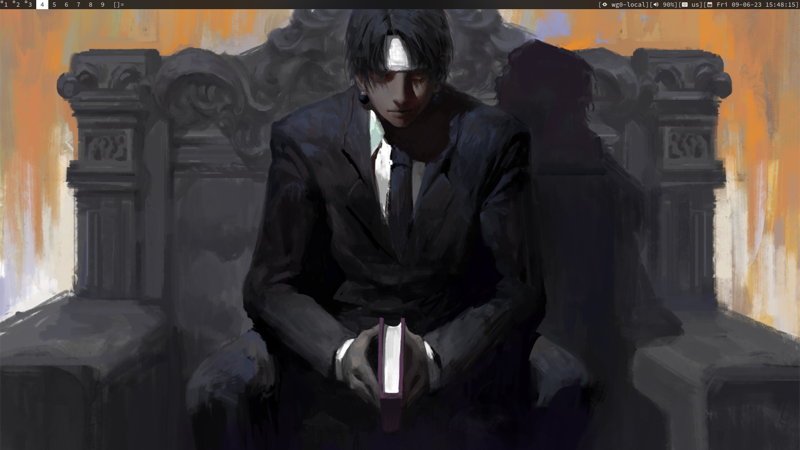
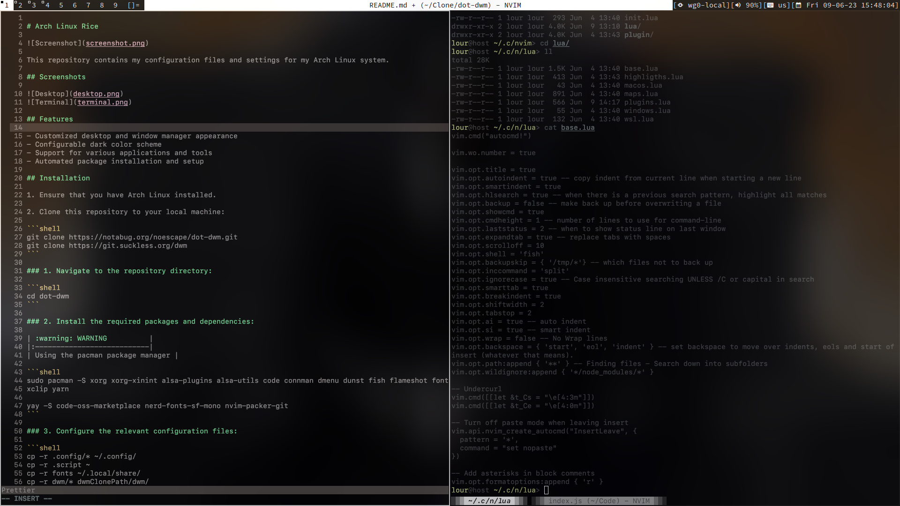

# Arch Linux Rice

This repository contains my configuration files and settings for my Arch Linux system.

## Screenshots




## Features

- Customized desktop and window manager appearance
- Configurable dark color scheme
- Support for various applications and tools
- Automated package installation and setup

## Installation

1. Ensure that you have Arch Linux installed.

2. Clone this repository to your local machine:

```shell
git clone https://notabug.org/noescape/dot-dwm.git
git clone https://git.suckless.org/dwm
git clone https://github.com/joestandring/dwm-bar.git
```

### 1. Navigate to the repository directory:

```shell
cd dot-dwm
```

### 2. Install the required packages and dependencies:

| :warning: WARNING          |
|:---------------------------|
| Using the pacman package manager |

```shell
sudo pacman -S xorg xorg-xinint alsa-plugins alsa-utils code connman dmenu dunst fish flameshot font-manager fuse2 go kitty lua-language-server luarocks ly mons mpc mpv neovim networkmanager networkmanager-openvpn nitrogen nodejs npm openresolv pamixer pass picom playerctl pulseaudio python-pillow ranger sxhkd wget
xclip yarn

yay -S code-oss-marketplace nerd-fonts-sf-mono nvim-packer-git
```

### 3. Configure the relevant configuration files:

| :warning: WARNING          |
|:---------------------------|
| Edit your path in .script/autostart.sh |

```shell
cp -r .config/* ~/.config/
cp -r .script ~
cp -r fonts ~/.local/share/
cp -r dwm/* dwmClonePath/dwm/

fc-cache -fv

cd dwmClonePath/dwm
sudo make && sudo make clean Install
```

### 4. Reboot your system:

```shell
reboot
```

### 5. After the reboot, enjoy your customized Arch Linux system!

## Issues and Support

If you encounter any issues while using this repository or have any questions, please create an issue in the [Issues](https://notabug.org/noescape/dot-dwm/issues) section.

## License

This project is licensed under the [MIT License](https://notabug.org/noescape/dot-dwm/src/master/LICENSE).

